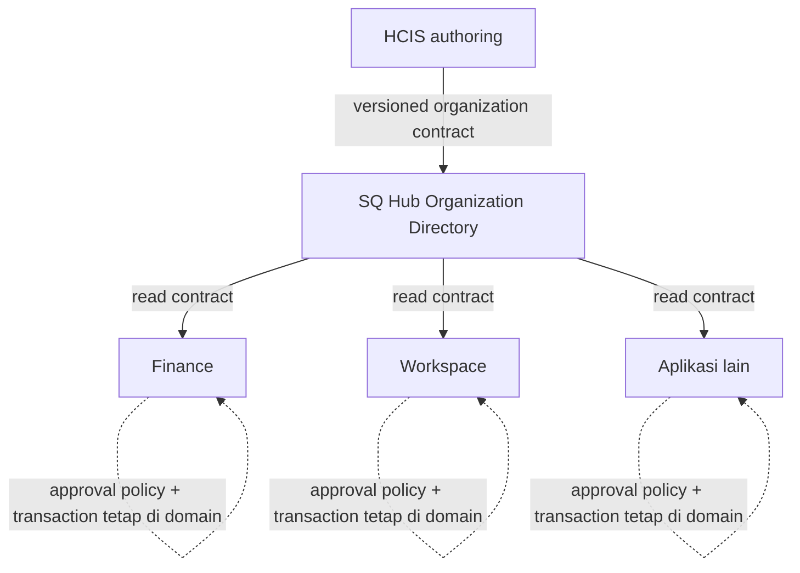

# ADR-0007: HCIS-authored Organization Directory

**Status:** Accepted  
**Date:** 2026-09-18

## Context

Dokumentasi foundation sebelumnya menempatkan `Organizational Unit master` sebagai target capability milik SQ Hub. Keputusan tersebut menimbulkan batas ownership yang tidak tepat karena struktur organisasi tenaga kerja adalah bagian dari domain Human Capital yang sudah di-author dan digunakan oleh HCIS.

Product Owner menetapkan bahwa HCIS tetap menjadi **system of authority** dan tempat authoring struktur organisasi tenaga kerja. Kebutuhan lintas aplikasi tetap nyata: Finance, Workspace, dan aplikasi domain lain membutuhkan fakta organisasi yang konsisten tanpa masing-masing membuat direct integration ke database HCIS.

Keputusan ini memisahkan **authoring/authority** dari **shared projection/distribution**.

## Decision

### Ownership

| Data/capability | Authority / owner |
| --- | --- |
| Unit organisasi tenaga kerja | HCIS |
| Posisi/jabatan | HCIS |
| Penempatan pegawai | HCIS |
| Hubungan atasan | HCIS |
| Effective dates organisasi/penempatan | HCIS |
| Data ketenagakerjaan terkait | HCIS |
| Shared Organization Directory projection/read model | SQ Hub |
| Organization distribution/read contract lintas aplikasi | SQ Hub |
| Approval policy | aplikasi domain masing-masing |
| Workflow state | aplikasi domain masing-masing |
| Delegation dan escalation | aplikasi domain masing-masing |
| Domain authorization | aplikasi domain masing-masing |
| Audit keputusan/transaksi | aplikasi domain masing-masing |

HCIS adalah satu-satunya authoring system untuk fakta workforce organization di atas. SQ Hub tidak menyediakan authoring/edit path untuk data organisasi milik HCIS.

SQ Hub menyediakan **Organization Directory** sebagai read model/distribution layer lintas aplikasi. Hub menerima data organisasi dari HCIS melalui integration contract yang terautentikasi dan terkontrol, lalu menyediakan read contract kepada consumer yang berwenang.

### Aliran data

Aplikasi lintas domain **sebaiknya membaca Organization Directory dari Hub**, bukan membuat integrasi database HCIS sendiri. Keputusan ini tidak melarang contract langsung HCIS-ke-domain bila kelak ada kebutuhan domain khusus yang disetujui; default shared-read path tetap melalui Hub.

### Larangan boundary

Dilarang:

- direct database coupling dari Hub atau aplikasi lain ke database HCIS untuk organization integration;
- dual-write fakta organisasi ke HCIS dan Hub;
- master organisasi paralel;
- menjadikan Keycloak sebagai organization master;
- memindahkan business workflow domain ke Hub;
- menjadikan Hub central approval engine.

### Consistency, effective dating, dan staleness

Organization Directory adalah projection dari HCIS, bukan second master.

Setiap projection/read response yang relevan harus dapat membawa metadata yang cukup untuk menjelaskan freshness dan asal data, minimum secara konseptual:

- `source`;
- `version`;
- `synchronized_at` dan/atau `as_of`;
- indikator staleness.

Hub harus dapat melayani **last-known-good** organization projection ketika HCIS sementara tidak tersedia. Consumer harus dapat membedakan data current/fresh dari data stale; Hub tidak boleh menyamarkan kegagalan sinkronisasi sebagai data baru.

Bentuk identifier global, format/version semantics, snapshot versus delta, conflict handling, SLA freshness, dan retention **belum diputuskan** dan tetap DISCOVERY/TBD.

Effective dates adalah fakta yang dimiliki HCIS. Contract Hub harus mempertahankan makna effective dating yang disuplai HCIS; detail representasi dan query semantics ditentukan pada specification implementasi.

## Approval-chain boundary

Hub hanya menyediakan **fakta organisasi** yang dapat digunakan aplikasi domain untuk menentukan kandidat approver atau scope. Hub tidak menentukan approval policy dan tidak menjalankan transaksi approval.

Saat transaksi diajukan, aplikasi domain harus menyimpan snapshot approver yang sudah di-resolve beserta organization version/effective time yang digunakan. Perubahan struktur organisasi berikutnya tidak boleh diam-diam menulis ulang approval yang sedang berjalan, kecuali domain tersebut memiliki aturan eksplisit yang mengatur re-resolution.

Setiap aplikasi domain tetap memiliki dan mengaudit:

- approval policy;
- workflow state;
- delegation;
- escalation;
- authorization domain;
- keputusan/transaksi approval.

## Security and privacy

- Integration HCIS → Hub menggunakan dedicated service identity; jangan reuse credential manusia.
- Contract dan read API menerapkan least privilege dan authentication/authorization eksplisit.
- Organization Directory hanya memproyeksikan data yang dibutuhkan lintas aplikasi; hindari menyalin PII atau data ketenagakerjaan yang tidak diperlukan.
- Secret, credential, token, dan session material tidak menjadi bagian organization payload.
- Audit metadata harus cukup untuk menelusuri sinkronisasi tanpa menyimpan secret atau data pribadi yang tidak diperlukan.
- Keycloak tetap authentication/identity engine dan bukan source of truth organisasi.

## Failure behavior

- Jika HCIS tidak tersedia, Hub boleh melayani last-known-good projection beserta metadata staleness yang jujur.
- Kegagalan sinkronisasi tidak boleh menyebabkan Hub menulis balik ke HCIS atau membuat master alternatif.
- Consumer menentukan perilaku domain ketika data stale berdasarkan risk/policy domain masing-masing; Hub tidak mengarang approval decision.
- Reconciliation harus dapat mendeteksi divergence/gap dan aman untuk diulang.
- Recovery tidak boleh membutuhkan destructive rewrite terhadap HCIS sebagai system of authority.

## Consequences

Positif:

- ownership workforce tetap berada pada domain HCIS;
- consumer lintas aplikasi memperoleh satu distribution surface yang konsisten;
- coupling database HCIS tidak menyebar ke setiap aplikasi;
- Hub dapat memberi availability read model melalui last-known-good projection;
- approval/workflow tetap independen dan dapat berevolusi per domain.

Trade-off:

- dibutuhkan integration contract, projection lifecycle, reconciliation, dan freshness semantics;
- consumer harus memahami metadata version/effective time/staleness;
- perubahan struktur organisasi dan transaksi berjalan memerlukan snapshot discipline di domain app.

## Migration / cutover principle

Tidak ada migration yang memindahkan authoring organisasi dari HCIS ke Hub.

Implementasi mendatang harus berlangsung bertahap:

1. audit source fields dan identifier HCIS;
2. definisikan versioned organization contract;
3. bangun projection Hub tanpa mengubah HCIS authoring;
4. verifikasi reconciliation dan last-known-good behavior;
5. onboard consumer ke read contract Hub;
6. hilangkan integrasi paralel hanya setelah consumer terverifikasi.

Tidak boleh ada dual-write atau import/cutover yang menjadikan Hub master organisasi.

## Open decisions — DISCOVERY / TBD

Belum diputuskan:

- SLA sinkronisasi/freshness;
- identifier global lintas aplikasi dan mapping dari identifier HCIS;
- snapshot versus delta contract;
- exact versioning scheme;
- conflict/gap handling;
- retention/history policy;
- exact reconciliation cadence/mechanism;
- recovery thresholds dan operational alerting.

Identifier HCIS yang ada **tidak otomatis** dianggap cocok sebagai identifier global lintas aplikasi; harus diaudit sebelum implementation.

## Relationship to ADR-0001

ADR-0001 tetap berlaku untuk boundary platform secara umum. Bagian ADR-0001 yang menyatakan `Organizational Unit master` sebagai capability milik SQ Hub **disupersede secara terbatas** oleh ADR-0007.

Interpretasi yang berlaku setelah ADR-0007:

- workforce organization authoring/system of authority → **HCIS**;
- shared Organization Directory projection/distribution → **SQ Hub**;
- approval/workflow policy → **masing-masing aplikasi domain**.

Tidak ada bagian lain ADR-0001 yang diubah oleh keputusan ini.
